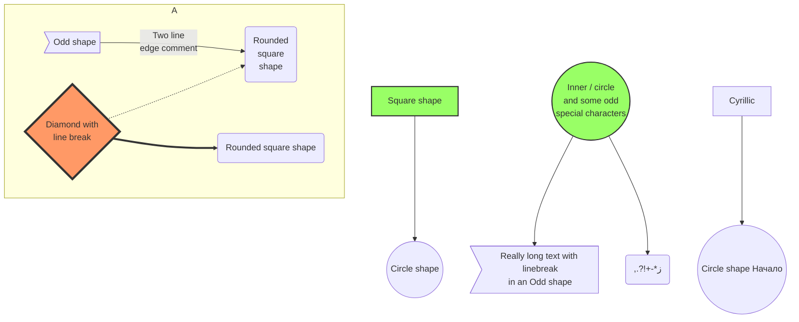

# Introduction

## Markdown ?

#### Markdown is a lightweight markup language designed to format text in a simple and readable way. It is commonly used for creating content for websites, documentation, or technical writing due to its ease of writing and conversion to HTML.

## The comparison between and MS Word/ Google Docs

- Markdown: Plain text - Suitable for writing technical documents.
  
- MS Word & Google Docs: Visualize Editor - Suitable for general writing purposes.

## How Markdown Works
> Markdown uses simple syntax to format text, for example

### 1. Plugin

- Markdown All in One 
- Markdown Preview Enhanced

### 2. Headings : Use the # character to create headings.

- `# Heading 1` 
- `## Heading 2` 
- `### Heading 3`

### 3. Formatting:

- Bold: **Bold text** or __Bold text__-> Text
- Italic: *Italic text* or _Italic text_ -> Text
- Strikethrough: ~~Strikethrough text~~ -> Text
- Normal text: `Normal text` -> Text
- >Blockquotes: > Blockquotes -> Text

### 4. Links and images

- Link: [Link text]([link url](https://www.google.com))
- Imange : )

### 5. Table

| Cột 1  | Cột 2     | Cột 3     |
| ------ | --------- | --------- |
| Hàng 1 | Giá trị 1 | Giá trị 2 |
| Hàng 2 | Giá trị 3 | Giá trị 4 |


### 6. Code style

```php
<?php
echo;
```
```js
console.log('Hello World');
```


### 7. Graph

##### Mermaid
  

 
### 8. Fomula math

- $S(z) = \frac{1}{1 + e^{-z}}$

### 9. Import file

@import "sample_data.csv"


### 10. HTML

<div align="center">
  
</div

